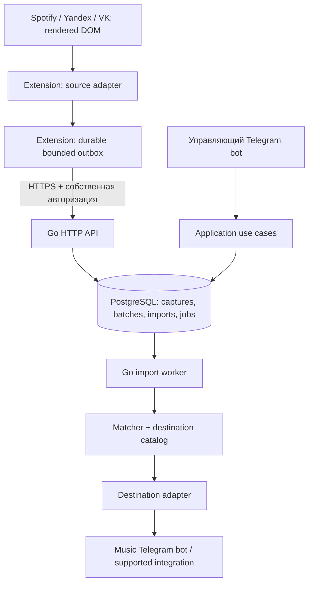

# Архитектура MusicGetter

Статус: принятые границы и проект контрактов; реализованы bootstrap backend, domain model, PostgreSQL repositories, управляющий
Telegram bot, собственные extension sessions и MV3 extension foundation
с popup/pairing/durable demo outbox. Yandex/Spotify/VK DOM adapters реализованы и проверены на fixtures (ADR-0013/0014/0015).
DOM capture и выбор отдельных треков подключены к popup/outbox (ADR-0016);
живые страницы пока не проверены вручную.
Приём импорта, worker и scored matcher реализованы (ADR-0017). Реальный destination adapter не подключён. Детали bootstrap — ADR-0008 и README, persistence — ADR-0009 и docs/database.md, Telegram/auth — ADR-0010, extension API — ADR-0011, extension runtime — ADR-0012.

## Поток данных



Ни сервер, ни worker не обращаются к Spotify/VK/Yandex. Source существует только
на стороне расширения; backend принимает нормализованные наблюдения. Поиск
идёт в каталоге destination через разрешённую им интеграцию, без обращения к
стримингам. Конкретная интеграция пока не выбрана и не считается доступной.

## Monorepo и зависимости

```text
.
├── AGENTS.md
├── README.md
├── LICENSE
├── go.mod / go.sum
├── Makefile
├── compose.yaml
├── .env.example
├── cmd/
│   ├── server/                 # рабочий bootstrap HTTP API
│   ├── migrate/                # отдельный migration runner
│   ├── bot/                    # управляющий Telegram bot
│   └── worker/                 # отдельный процесс import jobs
├── internal/
│   ├── app/                    # wiring и lifecycle сервера
│   ├── config/                 # environment configuration
│   ├── logging/                # JSON slog, context logger
│   ├── domain/                 # entities, states, metadata, fingerprint v1
│   ├── import/contracts.go     # lease port; upload.go — ingestion DTO/port
│   ├── pairing/                # issue/redeem/revoke собственных credentials
│   ├── matcher/contracts.go    # catalog и versioned matching policy
│   ├── destination/contracts.go
│   ├── storage/postgres/       # pool, readiness, Goose и domain repositories
│   ├── api/                    # transport, auth, DTO validation
│   └── telegram/               # handlers управляющего бота
├── extension/
│   ├── README.md
│   ├── package.json / package-lock.json
│   ├── scripts/                # builds Chrome/Firefox и tests
│   ├── tests/                  # core, API, storage, recovery
│   ├── tsconfig.json
│   └── src/
│       ├── background/         # trusted RPC, credentials, alarms
│       ├── content/            # DOM capture, scoped selection RPC и overlay
│       ├── popup/              # подключение, all/selected/demo, progress, cancel
│       ├── api/                # HTTP v1, timeout, safe errors
│       ├── storage/            # extension-origin IndexedDB
│       ├── core/               # DTO, adapters, bounded outbox engine
│       └── sources/
│           ├── spotify/
│           ├── yandex/
│           └── vk/
├── migrations/                # embedded Goose SQL + README
├── docs/
│   ├── architecture.md
│   ├── database.md
│   ├── protocol.md
│   ├── verification.md
│   └── adr/                    # 0001–0016 + индекс
└── deploy/Dockerfile           # server, migrate и bot, runtime без root
```

Пустые каталоги закреплены .gitkeep. cmd/worker добавлен, чтобы масштабирование
и перезапуск HTTP/bot процессов не зависели от длительных импортов. Это один
модульный backend с общей БД, без распределённых внутренних RPC. В разработке
возможен один процесс, но orchestration не связывается с HTTP handler lifetime.

Зависимости: transport → application (import, matcher) → domain; storage и
конкретные destination adapters реализуют узкие порты application. Wiring только
в cmd. Domain не импортирует infrastructure. `import` — имя каталога, `importer` —
имя Go package (import является ключевым словом).

Go 1.27.1, Go modules, net/http, slog, pgxpool и Goose Provider для миграций.
Прямые зависимости — pgx, Goose и golang.org/x/text для Unicode normalization;
sqlc пока не добавлен, SQL repositories небольшие и явные.
TypeScript 5.9.3 / esbuild, package lockfile и MV3 builds существуют.
Runtime dependencies отсутствуют; fake-indexeddb и jsdom используются только в tests.

## Извлечение из DOM

Каждый adapter сам определяет поддержанные страницы, разбирает видимые карточки,
строки и разрешённые ссылки. Общий core отвечает только за нормализованную схему,
очередь, транспорт и lifecycle. Selectors и смысл DOM не делятся между сервисами.

Виртуализированный список нельзя выгрузить одним querySelectorAll. Adapter
наблюдает уже отрендеренные строки при пользовательской прокрутке, сохраняет
пакеты постепенно и не удерживает DOM nodes. Помощь с прокруткой допустима только
в явно запущенном режиме с остановкой; она не должна вызывать скрытые запросы
самостоятельно или обходить доступ. Наличие DOM-элемента само по себе не означает
видимость: скрытые stores/scripts и неотображаемые payloads исключены.

Стабильный source key берётся из разрешённой видимой ссылки. URL разбирается
локально: сохраняется только разрешённый идентификатор/путь без query и fragment.
Если такой ссылки нет — provisional key из metadata с явной неопределённостью.
Нельзя объединять разные записи только по title/artist. Одинаковые наблюдения
можно сжать внутри capture, но fingerprint не доказывает тождественность аудиозаписи. По ADR-0009 canonical
metadata identity переиспользуется внутри profile между imports. По ADR-0018
успешный mapping, включая provisional identity, используется без повторного search;
ошибочное решение требует явной инвалидации.

Каждый capture относится к одной коллекции и выбранному source profile. Полный
импорт библиотеки — несколько captures коллекций, а не один огромный payload.
Profile задаётся пользователем без чтения streaming credentials. Пользователь
подтверждает profile при смене аккаунта в браузере; автоматического определения
реального streaming account и доказательства владения через DOM нет.

`complete` допускается лишь при проверяемом видимом конце и согласованном видимом
счётчике, если он есть. Тишина MutationObserver/таймаут — не доказательство полноты.
`partial` сохраняется и может импортироваться. Ни один capture не удаляет треки
из destination, отсутствующие в наблюдённой странице.

## Pipeline и состояния

1. Создать import (created), принимать чанки (receiving). Normalization/fingerprint
   и input dedup выполняются при записи каждого чанка. Capture state остаётся collecting.
2. Seal в одной транзакции создаёт jobs и queued; пустой import сразу completed.
3. Worker: processing → cached mapping или bounded search → scored_metadata_v1 (docs/matching.md).
   Item pending → searching → matched либо ambiguous/not_found.
4. Persisted membership intent → проверка applied/optional remote Contains/reconcile
   → atomic EnsureTrack → added/already_present. Unknown не означает отсутствие effect.
5. Последний item закрывает import: completed или completed_with_errors. Cancelled
   не откатывает effects. Failed зарезервирован для abort всего import.

Item states: pending, searching, matched, ambiguous, not_found, already_present,
added, failed. Внутреннее ожидание ensure/reconcile остаётся matched, intent — unknown.
Cancel отмечает незавершённые items failed с error_code=import_cancelled. Подтверждение
in-flight эффекта может перевести такой item в added при cancelled import.
API v1 сохраняет aggregate needs_review (ambiguous), failed (failed + not_found,
без import_cancelled), cancelled (error_code=import_cancelled).

Один durable job проходит item со checkpoint matched; SKIP LOCKED, lease heartbeat,
fencing всех DB transitions, bounded exponential retry/jitter и expired-lease repair.
Каждый slot держит один item и не более 200 accumulated candidates (50 на ответ). Лимит 1–64 slots/process.
Ambiguous results не разрешаются автоматически; review workflow пока не реализован.
Доставка допускается только через atomic membership adapter, подробнее ADR-0017.
Registry cmd/worker пуст; запускаемый worker честно завершит unsupported items ошибкой.
Unknown после отмены/исчерпания retries сохраняется для последующего import или
ручной reconciliation; отдельного background reconciliation daemon пока нет.

## Основные порты

- `SourceAdapter`: supports, inspect, capture (async bounded generator).
- `UploadStore`: CreateUpload, AppendChunk, CompleteUpload, CancelUpload, GetUpload;
  owner-scoped immutable replay и транзакции PostgreSQL.
- `JobQueue`: Claim, Renew, Complete, Retry, Fail; все изменения fenced lease.
- `PipelineStore`: Load, Matched, Intent, Finish, Reschedule; атомарные owner-scoped checkpoints.
- `Resolver`: connection → Destination + Catalog из trusted factory registry.
- `Catalog` / `Destination.TrackSearcher`: SearchTracks; предоставляет destination integration.
- `Matcher`: Match; policy version, ranked candidates, no silent ambiguous choice.
- `Destination`: Capabilities, EnsureTrack; связь с конкретным ботом скрыта.
- Опциональные `MembershipReader`, `OperationReconciler`, `TargetManager`.

Контракты приведены в .go/.ts; это compile-time границы, не готовый wire protocol.
Transport DTO не сериализуются напрямую из domain structs. DB repositories реализованы отдельно по ролям и принимают pgxpool или pgx.Tx;
универсального CRUD Store нет. Импортный HTTP flow пока не подключён.

## Идемпотентность и внешние эффекты

Идемпотентность действует на нескольких независимых уровнях:
- create/seal capture: собственный request key, replay возвращает тот же ресурс;
- batch: (capture, sequence) + server-calculated canonical digest, immutable replay;
- jobs: уникальный logical work key, lease generation;
- destination membership: (connection, target, destination_track_id);
- target creation: сохранённое mapping и стабильный operation key.

Source track и destination track не эквивалентны. Два исходных трека могут совпасть
с одним destination ID. UNIQUE membership относится к конечному ID и target,
поэтому protects favorites/playlist/album и между импортами, и между source adapters.
Дубликат в другом target допустим. В первой версии внутри target — set semantics:
повторные вхождения одного трека в исходном playlist не воспроизводятся.

Ledger знает только наблюдавшиеся системой операции. Чтобы не дублировать ранее
добавленные пользователем треки, adapter должен поддержать atomic ensure либо
надёжное чтение существующей membership. Native request idempotency сама по себе
не обнаруживает трек, ранее добавленный другим способом. Read-before-add безопасен
от наших конкурентных writes только при сериализации target; при внешних writers
без atomic ensure строгая гарантия невозможна. В строгом режиме такие destinations
не допускаются, пока не доказано исключительное владение записью и reconciliation.

После timeout возможен успешный внешний effect. Нельзя просто повторить send.
Повтор разрешён только с native idempotency/atomic ensure либо после достоверного
определения результата. ReadMembership=false + нет безопасного ensure/reconciliation
означает unsupported capability, а не ослабление требований пользователя.
Database fencing предотвращает устаревший commit, но не отменяет внешний запрос.

## Масштабирование и эксплуатация

Стартовые проектные лимиты: до 200 items и 512 KiB JSON на batch, до 4 batches
in flight, bounded outbox до 20 MiB с паузой при переполнении, keyset pages до 200.
Это настройки, а не обещания измеренной производительности. При 50 000 треков
очередь хранится в БД; клиент хранит только неподтверждённые batches и compact keys.
Контрольные задачи на диапазоны/items, не один job на всю библиотеку и не
неограниченная fan-out загрузка. Индексы и нагрузочные критерии — в database/verification.

Job claim использует короткую транзакцию SKIP LOCKED. Lease heartbeat, generation,
exponential backoff + jitter и max attempts. Destination-specific rate budget пока
остаётся ответственностью будущего адаптера; worker ограничивает concurrency.
Crash между DB commit и запуском worker покрывает durable jobs. Crash вокруг
внешнего effect покрывают ledger и reconciliation, не транзакция PostgreSQL.

Планируемые метрики (экспортёр пока не реализован): backlog/oldest job age, retries, capture partial rate, match ambiguity,
unknown effects, latency и rate limiting. slog пишет correlation IDs и safe error
codes; названия треков, коллекций, Telegram сообщения и секреты по умолчанию исключены.
TLS снаружи; migrations выполняются отдельным release step. Go/DB timeouts,
graceful shutdown с прекращением claim и завершением/освобождением leases.
Сроки хранения, резервные копии и удаление пользователя уточняются до production.

## Открытые вопросы

- Какой музыкальный destination и какой разрешённый протокол реально доступны?
  Работа обычного Telegram Bot API сама по себе не доказывает bot-to-bot delivery.
  Автоматизацию пользовательского аккаунта не вводим по умолчанию.
- Есть ли atomic ensure, поиск, чтение membership, receipts и поддержка albums?
  Без них часть требований может оказаться невыполнимой для выбранного бота.
- Album: в проекте это source collection → destination target; если destination
  не поддерживает album, предложить явно согласованный playlist или отказ.
- Set semantics теряет повторные позиции playlist; порядок первой версии — best
  effort. Нужны ли повторы/точный порядок — отдельное продуктовое решение.
- DOM selectors и признаки полного обхода ещё нужно проверить на реальных страницах.
- Пороги matcher, длительности leases, retention/quotas, hosting, поддерживаемые
  версии browser требуют реализации и измерений. Bootstrap использует Go 1.27.1
  и PostgreSQL 17 в Compose; integration suite также проверен на локальном PostgreSQL 14.
